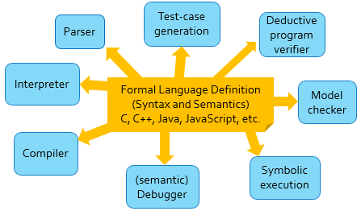

\newcommand{\K}{\ensuremath{\mathbb{K}}}

\newpage

Abstract
--------

Implementing compilers takes a long time and is error prone; it's easy to introduce differences in behaviour between various compilers.
Instead, we can build derive an initial compiler directly from a formal operational semantics using partial evaluation.
This approach is correct by construction, if you trust the formal specification then the derived compiler is correct.

We demonstrate this on two languages, IMP (a simple imperative language), and FUN (a functional language with algebraic datatypes) using the \K{} Framework.
Over our benchmarks, we see an average **###NIMP###-times** performance gain for the IMP language, and an average **###NFUN###-times** performance gain for the FUN language.
Our tool naturally performs many optimizations such as expression-folding and dead-code elimination due to the nature of symbolic execution.

In addition to improving the execution performance of the programs, the partially evaluated definition can be inspected for errant behaviours.
This partially evaluated definition serves as the initial specification of the program, which can be refined and then run through the \K{} prover as needed.

We believe this solidly demonstrates that we can take a semantics-first approach to tooling around a programming language.
With performance approaching that of hand crafted compilers, there is less need for ad-hoc models of programming languages built into large compiler frameworks.

Introduction
============

### Motivation

-   Discuss bugs in compilers and differences in behaviour between multiple compilers (cite RV-Match?).

-   Discuss semantics-first approach, how we can avoid a lot of the confusing differences between ad-hoc models by deriving everything from a single specification.

### Related Work

-   Work on Order-Sorted Equational partial evaluation by Santiago Escobar.

-   Dig up other work on partial evaluation.

Background
==========

### Program Executions

\renewcommand{\S}{\ensuremath{\mathcal{S}}}
\renewcommand{\P}{\ensuremath{\mathcal{P}}}
\renewcommand{\L}{\ensuremath{\mathcal{L}}}
\newcommand{\R}{\ensuremath{\mathcal{R}}}

\newcommand{\N}{\ensuremath{\mathbb{N}}}

\newcommand{\STUCK}{\ensuremath{\texttt{STUCK}}}
\newcommand{\st}{\ensuremath{\ |\ }}

Given a set of program states $S$, states $\S = \P(S) \cup \{ \STUCK \}$, and a set of rules $\R : S \to \S$, we have a *transition system* $(\S, \R)$.

-   The *transition relation* is $\hat{\R} \subseteq \S \times \S$ is $\{ ( \STUCK , \STUCK ) \} \cup \{ (s_1, s_2) \in S \times S \cup \{ \STUCK \} \st s_2 \in \R(s_1) \}$.

-   $\R' : S \to \S$ is an *over-approximation* of $\R$ if $\forall s \in S . \R(s) \subseteq \R'(s)$.
    This defines a partial order $\R \leq \R'$, and lifts over transition systems as follows: $(\S, \R) \leq (\S, \R')$ iff $R \leq \R'$.

-   A sequence $e : \N \to \S$ such that $e(i + 1) = \hat{R}(e(i))$ is an *execution* of $(\S, \R)$.
    A *terminating* execution has some $n \in \N$ such that $\forall m > n . e(m) = \{ \STUCK \}$.

-   A *labelling* of $\R$ is a finite set $\L$ such that $\forall s \in \S . R(s) = \bigcup_{l \in L} R_l(s)$.

-   A sequence $F : \N \to \L$ specifies an execution *strategy*.
    The associated execution $F_s : \N \to \P(\S)$ of a given initial state $s \in \P(\S)$ is as follows:

    \begin{align*}
        F_s(n) = \begin{cases}
                  s                         & n = 0 \\
                  \R_{F(n - 1)}(F_s(n - 1)) & n > 0
                 \end{cases}
    \end{align*}

    That is, $F_s$ is the restriction of $(\S, \R)$ to a transition system which starts in state $s$ and executes only the rules specified by $F$.

### Partial Evaluation

-   Discuss projecting transition systems, how we can do two types of partial evaluation using symbolic execution:

-   Compress chains (paths with no branching) to a single transition - performance improvement.

-   Remove parts of transition systems which are not used (eg. if I never use `struct` in a C program, I don't need the semantics of `struct`).
    Can significantly reduce the branching factor of the transition system.

### \K{} Framework

-   Operational semantics framework



Example Languages
=================

IMP: A simple imperative language {#imp-language}
-------------------------------------------------

### State

Configuration has two cells, the `<k>` cell for holding the remainder of the program and the `<mem>` cell for storing the mapping between program variables and values.

```k
    configuration
      <imp>
        <k>   $PGM:Stmt </k>
        <mem> .Map      </mem>
      </imp>
```

### Rules

Example rules for this language are `lookup` and `assignment`, which interact with the `<mem>` cell.

```k
    rule <k> X:Id        => I ... </k> <mem> ... X |-> I        ... </mem>
    rule <k> X = I:Int ; => . ... </k> <mem> ... X |-> (_ => I) ... </mem>
```

### Programs

An example program in this language is `sum.imp`, which sums the numbers from 1 to 10 stores the result in a variable `s`.

```imp
int n , s ;
s = 0 ;
n = 10 ;
while (0 <= n) {
  s = s + n ;
  n = n + -1 ;
}
```

We would like to summarize this program as the following transition system:


### Important Observations

The following observations about IMP are important for proving that the SBC algorithm presented is correct:

1.  All variables are introduced at the beginning of a program.

2.  The branching rules (`iftrue`, `iffalse`, `divzero`, and `divnonzero`) are only dependent on the contents of the `mem` cell.

3.  On any infinite execution of an IMP program, the following `whileIMP` rule will fire infinitely often:

    ```k
        syntax Stmt ::= "while" "(" BExp ")" Block
     // ------------------------------------------
        rule <k> while (B) STMT => if (B) {STMT while (B) STMT} else {} ... </k>
    ```

FUN: A simple functional language {#fun-language}
-------------------------------------------------

### State

Configuration has three cells: the `<k>` cell for the current computation, the `<env>` cell for the current environment, and the `<envs>` cell for past environments.

```k
    configuration
      <FUN>
        <k>    $PGM:Exp </k>
        <env>  .Map     </env>
        <envs> .List    </envs>
      </FUN>
```

### Features

This language includes polymorphic algebraic data-types and supports pattern matching over said data-types.
The function application operator is juxstaposition (similar to Haskell), and algebraic datatypes have constructors that start with uppercase identifiers.
FUN supports partial application of both constructors and functions.
The operational semantics assumes that the input program has already been type-checked[^typeErasure].

FUN also supports recursion, using a `letrec_in_` binding (counterpart to the non-recursive `let_in_` binding operator).
Looping happens when the function body `E` of a function (`fun f p1 ... pn -> E`) defined in a recursive `letrec` is invoked.
When beginning execution of the body `E`, bindings from the recursive environment are added to the current environment.

[^typeErasure]: **TODO** Mumble mumble, something about type erasure.

### Programs

Simple sum from 1 to 10:

```fun
letrec sum = fun 0 -> 0
             |   n -> n + sum (n - 1)
in sum 10
```


Folding over a polymorphic tree data-type:

```fun
datatype 'a tree = Leaf | Tree ('a tree) 'a ('a tree)

let g x y z = x + y + z
 in letrec foldtree f b = fun Leaf                -> b
                          |   (Tree left n right) -> f n (foldtree f b left) (foldtree f b right)
        in foldtree g 0 (Tree (Tree (Tree Leaf 3 Leaf) 6 (Tree Leaf 21 Leaf)) 1 (Tree Leaf 11 Leaf))
```

which folds the following tree:

```
    1
   / \
  6   11
 / \
3  21
```

into the value `42` using a `foldtree` function.


### Important Observations

The following observations about FUN are important for proving that the SBC algorithm presented is correct:

1.  Each step of the pattern-matching procedure creates a branching point in execution, giving a high branching factor to FUN programs which use pattern-matching.

2.  On any infinite execution of a FUN program, the following `recCall` rule will fire infinitely often:

    ```k
        syntax Exp ::= mu ( Names , Exp )
     // ---------------------------------
        rule <k> mu ( .Names , E ) => E ... </k>
    ```

    This rule fires after all the bindings of the recursive environment have been added to the new environment.

Methodology
===========

The SBC algorithm was written directly in \K{} itself, taking advantage of some of \K{}'s features.
We cover these features, then explain how this implements the abstract algorithm described above.

\K{} Features
-------------

The two main features of \K{} which enable us to write the algorithm directly as a \K{} theory are *configuration composition* and the *strategy language*.

### Configuration Composition

We would like to execute the original \K{} semantics directly, but wrap it in an execution harness which monitors and guides the execution.
This will ensure that we are using the correct semantics (since we are directly using the original one), while letting us record execution or abstract the current state.

The extra state we want to record is the set of rule traces which correspond execution in the abstracted semantics.
We store those new transition in the `<rules>` cell, and have an extra `<states>` cell for internal bookkeeping.
The `<s>` cell will be covered in the next section.

```k
    configuration
      <kat>
        <s>      .Strategy </s>
        <states> .States   </states>
        <rules>  .Rules    </rules>
      </kat>
```

Most of the SBC algorithm can be written directly over this `<kat>` configuration in a completely language-independent way.
When the language designer goes to instantiate SBC to a particular, configuration composition is used to specify the joint state.
For example, instantiated to [IMP](#imp-language) results in the following configuration:

```k
    configuration
      <kat-imp>
        initKatCell(Init)
        <harness> initImpCell(Init) </harness>
      </kat-imp>
```

The placeholders `initKatCell(Init)` and `initImpCell(Init)` will expand out to the entire `<kat>` and `<imp>` configurations, respectively.
In the module which composes these configurations, the language designer will also specify the remaining needed components of SBC.

### Strategy Language

The \K{} strategy language allows us to drive execution of a given language from within \K{} itself.
Every \K{} definition has the `<s>` cell added to every rule by default, and the default initial strategy (contents of `<s>`) is `^ regular *`.

For example, the following rule:

```imp
    rule <k> int (X, XS => XS) ; ... </k>
         <mem> MEM => MEM [ X <- 0 ] </mem>
```

will be expanded into the rule:

```imp
    rule <k> int (X, XS => XS) ; ... </k>
         <mem> MEM => MEM [ X <- 0 ] </mem>
         <s> ^ regular => ~ regular ... </s>
```

This means that the rule will only fire when \K{}'s current strategy is to execute a `regular` rule.
By default, every rule is tagged as `regular`, but the user can override the given tag, for example:

```imp
    rule <k> while (B) STMT => if (B) {STMT while (B) STMT} else {} ... </k> [tag(whileIMP)]
```

will instead expand into:

```imp
    rule <k> while (B) STMT => if (B) {STMT while (B) STMT} else {} ... </k>
         <s> ^ whileIMP => ~ whileIMP ... </s>
```

We can use this to tell \K{} which rule to attempt to fire next, and record the results as we go.
For example, if we picked the strategy `(^ regular ; record) *` (where `record` makes a copy of the current state on the `<states>` cell), we would get a recording of all traces which only execute `regular` rules.

Semantics Based Compilation
---------------------------

The algorithm for a single SBC step in \K{}'s strategy language is as follows:

1.  If we can extend the current execution trace with a `#loop`ing rule:

    a.  Make a new rule with our current execution trace (`mk-rule STATE`).
    b.  Abstract the current state (`pop-fresh STATE ; abstract`).
    c.  Execute the `#loop`ing rules on the abstracted state, and new traces with those states.

2.  Else if we can extend the current execution with a `#branch`ing rule:

    a.  Split the current execution on all the `#branch`ing rules that can be applied.

3.  Else if we can extend the current execution with either a `^ regular` or `#normal` rule:

    a.  Extend the current execution with as many `^ regular` or `#normal` as possible.

4.  Else we must be on the terminal state of an execution path, make a new rule with the collected path.

```k
    rule <states> STATE : STATES => STATES </states>
         <s> compile-step
          => if try-state? STATE < #loop >
              then ( mk-rule STATE
                   ; pop-fresh STATE
                   ; abstract
                   ; init-rules #loop
                   )
             else if try-state? STATE < #branch >
              then ( split-rules STATE #branch
                   )
             else if try-state? STATE < ^ regular | #normal >
              then ( push STATE < (^ regular | #normal) * > )
             else  ( mk-rule STATE )
             ...
         </s>
```

Given the above algorithm, the user must supply:

-   The `#normal`, `#branch`, and `#loop` rule tags (by labelling the rules appropriately).
-   The `abstract` operator to use whenever a `#loop` rule can fire.

The supplied `abstract` operator must have the properties of $\alpha$ above; that is, every execution which uses `abstract ; #loop` instead of `#loop` must terminate.

Example Languages
-----------------

### IMP

Four branching rules, one looping rule:

```k
    rule #branch => ^ iftrue | ^ iffalse | ^ divzero | ^ divnonzero
    rule #loop   => ^ whileIMP
```

Abstraction operator turns every value in the memory to a fresh symbolic value:

```k
    syntax Strategy ::= #abstract ( Set )
 // -------------------------------------
    rule <s> abstract => #abstract(keys(MEM)) ... </s>
         <mem> MEM </mem>

    rule <s> #abstract(.Set) => . ... </s>
    rule <s> #abstract((SetItem(X) => .Set) XS) ... </s>
         <mem> MEM => MEM[X <- ?V:Int] </mem>
```

### FUN

-   Many branching rules (30ish?)
-   One looping rule when about to execute function body of recursively defined function.
-   Abstraction operator forgets all values in current environment, and forgets how many nested environments we're in.

Performance Evalutaion
======================

-   Explanation of performance gains, show that we can get arbitrary gains.

-   Chart of gains for looped programs where we drive the number of iterations up.

Specification Generation
========================

-   Start with SBCed definition of `sum`.

-   Show what a specification of `sum` looks like.

-   What changes are needed beyond the SBCed definition to get to a verified definition?

Conclusion
==========

-   It's great, use it!

Misc
====

We execute $P$ in a modified semantics $\alpha(L)$ which:

1.  Records execution traces $e_i$ with $e_i(0) = \hat{P}$.
2.  Always terminates.
3.  Overapproximates the behaviour of $L$ (for $(\S, \R) = \L$.

We partially evaluate the operational semantics of a language $L$ on a particular program $P$ to produce a language $L_P$.
The language $L_P$ can only execute program $P$.


To achieve the partial evaluation, we'll execute $P$ with an overapproximation of the language $\alpha(L)$ which is always terminating.
$\alpha$ must have the property that every execution of $P$ in $L$ must be preserved (in a stuttering sense) in $\alpha(L)$.

For \K{}, we'll use the same symbolic execution engine used by the \K{} prover (**TODO**: cite OOPSLA'16).
To ensure termination, we will only execute each code-point once, but on a general enough input to ensure every behaviour is covered.
End up with sequence of transitions from configurations to configurations, which can be expressed naturally as a \K{} definition where each transition is a rule.
New definition has a transition for every basic block of code, can directly execute the original program (but no other programs in the language[^fewOtherLanguages]).

[^fewOtherLanguages]: Actually *few* other programs in the language, as we take an overapproximation of the behaviour.

Algorithm
---------

-   Evaluate every "code point"/basic-block a single time.

    -   Define basic block (once in the basic block, will execute it fully to end unconditionally).

    -   User tells us which rules are "branching" and which are "looping" (so that we know where basic blocks begin and end).

    -   Split state on branches.

-   What about loops?

    -   At loop head, need to "abstract" state so that the new symbolic state will cover all possible executions from that point.
        Ensures that we only execute each loop exactly once, but that this covers all paths.
        Abstraction operator is language specific (but *not* program specific), a little extra work for the builder of the semantics.

    -   When an execution path reaches a loop head, save off the execution path as a new transition in the partially evaluated definition.
        New definition only has three types of transitions in it:

        a.  `INIT => _`: Transition from the initial state to another state.

        b.  `LOOP_i => LOOP_j`: Transition from one loop head to another loop head (potentially the same loop head).

        c.  `_ => END`: Transition from a state in the transition system to an ending state.

        Nodes are not inserted for branching, as that would reduce potential dead-code elimination.
